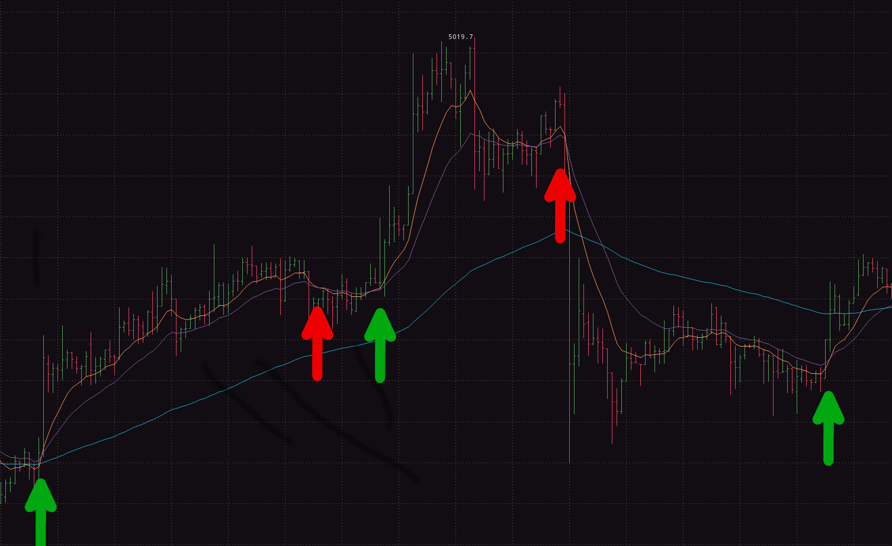

# cryptobot

At the beginning of 2018 I locked myself into a AirBnB for two days to build a Bitcoin trading bot in Python.
At the end of this weekend I had a working trading bot that could buy and sell Bitcoin as well as a simple algorithm based on moving averages for deciding when to buy/sell.

After a couple of weeks tweaking the algorithm I let the bot trade for 30 days in April 2018 

(it did not make any money, ...)

I presented this project at the *PyDays Vienna in 2019*. Here you see the slides:

[https://slides.com/antonpirker/building-a-bitcoin-trading-bot-in-python](https://slides.com/antonpirker/building-a-bitcoin-trading-bot-in-python)

The presentation was more about how to get something done in a weekend than trading bitcoin.

Currently the bot is defunct because the API I used for trading and getting real time price information of Bitcoin became really expensive, too expensive for running this bot for fun.

## Description of the code

This are just a couple of plain python scripts that where run on a cheap server.

The most important parts are:

* `fetch_prices.py` - A script that connects to a websocket to receive realtime Bitcoin trading information. The script saves the data into a Postgres database.
* `trade.py` - The main trading script. It was run once every minute and it decided (base on the data that `fetch_prices.py` saved in the database) if the time was right to buy or sell coins.
* `status.py` - A simple script that just reads from the trading API how many coins I have and what trades where made. It generates a index.html file and puts it somewhere for nginx to serve.

And that's basically it. It is really simple, but it worked great.

## Running the code

I used [supervisor](http://supervisord.org/) to start and keep `fetch_prices.py` and `trade.py` running in case one of the script crashes.

The `trade.py` script basically did an endless loop where it made a trading decision, made a buy/sell and then went to sleep for 60 seconds after wich it woke up and did the same again, and again, and again.

The `fetch_prices.py` script just opens up a websocket connection to a Bitcoin prices API and listens for incoming trades to save them in to the database.

I had a cronjob that killed `fetch_prices.py` every once in a while because the websocket connect hung sometimes.

It worked great. I started it once and it run the test month without a problem.

## The trading algorithm

The algorithm was really simple. It is based on a long term moving average and a short term moving average.

In this chart the orange line is the short term moving average and the purple line is the long term moving average.

When the short term moving average crosses the long term moving average from below it is a buy signal, and if the short term moving average crosses the long term moving average from above it is a sell signal.

So at the green arrows you buy, and on the red arrows you sell.
Very simple!

I started with the long term being 2 hours and the short term 1 hour. But this did not work out. I let my `fetch_prices.py` run for around two months to gather data. Then I created a Jupyter Notebook called `finetune-1m.ipynb` to find the optimal long and short term durations for the previous months. I tried all combinations from 1 minute to 180 minutes for the long and short term duration and simulated trading for the previews two months. (Calculating this took several hours or even days) I used the combination with the most gains of the previous two months and configured my trading bot with them and restarted it.

When simulating the trading for the two months in the past, my script really achieved tremendous gains. (crypto lambo moon kind of gains.) 

Turns out, what works for the past does not work necessarily for the future. I did not became a Bitcoin millionaire after all. ;-)

I wanted to implemented a dynamic configuration of the short and long term periods in my trade.py, So every hour or so, the script would simulate all the duration combinations for trading of the last couple of hours/days and then decide what settings for long and short term duration it would use for the coming couple of hours. Because this simulation took really long I would have needed a beefier server so make this happen. And then also the Bitcoin price plummeted so I lost motivation.
